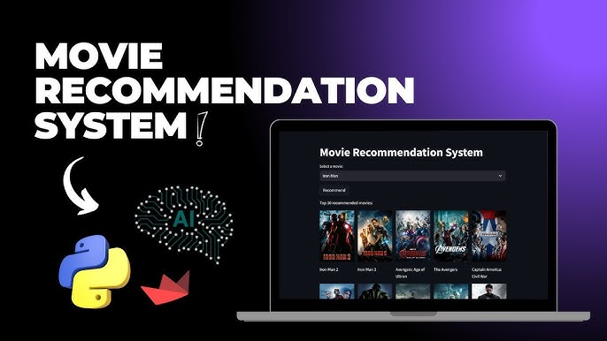

<div align="center">


<br><br>

<h1>🎬 CineMatch — Movie Recommender System</h1>

<p align="center">
  <em>A content-based movie recommendation engine powered by NLP, Cosine Similarity, and the TMDB dataset — wrapped in a sleek Streamlit UI.</em>
</p>

<a href="#-demo">View Demo</a> ·
<a href="#-features">Features</a> ·
<a href="#-installation">Installation</a> ·
<a href="#-how-it-works">How It Works</a> ·
<a href="#-dataset">Dataset</a> ·
<a href="#-contributing">Contributing</a>

<br>



</div>

---

## 📌 Table of Contents

- [Overview](#-overview)
- [Demo](#-demo)
- [Features](#-features)
- [Tech Stack](#-tech-stack)
- [Project Structure](#-project-structure)
- [How It Works](#-how-it-works)
- [Dataset](#-dataset)
- [Installation](#-installation)
- [Usage](#-usage)
- [API Configuration](#-api-configuration)
- [Model Details](#-model-details)
- [Contributing](#-contributing)
- [License](#-license)
- [Author](#-author)

---

## 🧭 Overview

**CineMatch** is an intelligent, content-based movie recommendation system that suggests the top 5 movies similar to any movie you select. It analyzes movie metadata — including genres, keywords, cast, crew, and plot overview — to compute similarity scores using **TF-IDF vectorization** and **Cosine Similarity**.

Movie posters are fetched in real-time from the **TMDB API**, giving the app a rich, visual experience. The system was trained on the **TMDB 5000 Movie Dataset** (~5,000 movies).

> 📚 Built as part of an AI/ML project at **Abdul Wali Khan University Mardan**, 6th Semester.

---

## 🎥 Demo

<div align="center">
  
</div>

**Live Demo:** *(Streamlit Cloud link here)*
[](https://your-app-name.streamlit.app)

---

## ✨ Features

- 🔍 **Content-Based Filtering** — Recommendations based on movie metadata, not user ratings
- 🎭 **Multi-Feature Analysis** — Uses genres, keywords, cast (top 3), director, and plot overview
- 🖼️ **Live Movie Posters** — Fetches real-time poster images via TMDB API
- ⚡ **Fast Lookups** — Pre-computed similarity matrix stored as a pickle file for instant results
- 🎨 **Streamlit UI** — Clean, interactive dropdown with a 5-column recommendation grid
- 📦 **Portable Model** — Trained model serialized and loadable without retraining

---

## 🛠 Tech Stack

| Layer | Technology |
|---|---|
| **Language** | Python 3.8+ |
| **Web Framework** | Streamlit |
| **ML / NLP** | scikit-learn (CountVectorizer, Cosine Similarity) |
| **Data Processing** | Pandas, NumPy, ast |
| **Movie Data API** | TMDB (The Movie Database) API |
| **Model Serialization** | Pickle |
| **Dataset** | TMDB 5000 Movie Dataset (Kaggle) |
| **Environment** | Kaggle Notebooks / Local / Streamlit Cloud |

---

## 📁 Project Structure

```
cinematch-movie-recommender/
│
├── 📓 notebook/
│   └── notebook86c26b4f17.ipynb       # Data preprocessing & model training notebook
│
├── 🤖 model/
│   ├── movie_list.pkl                  # Processed movie DataFrame (serialized)
│   └── similarity.pkl                  # Precomputed cosine similarity matrix
│
├── 🎨 app.py                           # Streamlit application entry point
├── 📋 requirements.txt                 # Python dependencies
├── 📄 README.md                        # Project documentation
└── 📜 LICENSE                          # MIT License
```

---

## 🧠 How It Works

The recommendation pipeline has three stages:

### Stage 1 — Data Preprocessing (Notebook)

```
Raw TMDB CSV Files
      │
      ▼
Merge movies + credits on 'title'
      │
      ▼
Select features: [movie_id, title, overview, genres, keywords, cast, crew]
      │
      ▼
Parse JSON strings → Python lists  (ast.literal_eval)
      │
      ▼
Extract top 3 cast members + Director from crew
      │
      ▼
Collapse multi-word names (e.g., "Sam Mendes" → "SamMendes")
      │
      ▼
Combine all features into a single 'tags' column
      │
      ▼
Vectorize with CountVectorizer (max 5000 features, English stop words removed)
      │
      ▼
Compute 4803×4803 Cosine Similarity Matrix
      │
      ▼
Serialize → movie_list.pkl  +  similarity.pkl
```

### Stage 2 — Similarity Calculation

For any query movie, the system:
1. Looks up its index in the DataFrame
2. Retrieves its similarity scores against all ~4,800 movies
3. Sorts in descending order
4. Returns the top 5 results (excluding the query movie itself)

### Stage 3 — Streamlit App

```python
selected_movie  →  recommend()  →  [top 5 movie titles]
                                         │
                                         ▼
                               fetch_poster(movie_id)  ──►  TMDB API
                                         │
                                         ▼
                               Display in 5-column grid
```

---

## 📊 Dataset

| Property | Details |
|---|---|
| **Name** | TMDB 5000 Movie Dataset |
| **Source** | [Kaggle](https://www.kaggle.com/datasets/tmdb/tmdb-movie-metadata) |
| **Files** | `tmdb_5000_movies.csv` + `tmdb_5000_credits.csv` |
| **Total Movies** | ~4,803 (after merge & null removal) |
| **Key Columns Used** | `movie_id`, `title`, `overview`, `genres`, `keywords`, `cast`, `crew` |

---

## ⚙️ Installation

### Prerequisites

- Python 3.8 or higher
- pip package manager
- TMDB API Key ([Get one free here](https://www.themoviedb.org/settings/api))

### Step-by-Step Setup

**1. Clone the repository**

```bash
git clone https://github.com/your-itxsalmannkhann/cinematch-movie-recommender.git
cd cinematch-movie-recommender
```

**2. Create a virtual environment (recommended)**

```bash
python -m venv venv

# Windows
venv\Scripts\activate

# macOS / Linux
source venv/bin/activate
```

**3. Install dependencies**

```bash
pip install -r requirements.txt
```

**4. Generate the model files**

Open and run the notebook end-to-end in Kaggle or Jupyter:

```bash
jupyter notebook notebook/CineMatch Movie Recommender.ipynb
```

This produces `movie_list.pkl` and `similarity.pkl`. Place them inside a `model/` directory:

```bash
mkdir model
mv movie_list.pkl similarity.pkl model/
```

**5. Run the Streamlit app**

```bash
streamlit run app.py
```

Open your browser at `http://localhost:8501` 🎉

---

## 🚀 Usage

1. Launch the app with `streamlit run app.py`
2. Select any movie from the dropdown (type to search)
3. Click **"Show Recommendation"**
4. View 5 recommended movies with their posters

---

## 🔑 API Configuration

This project uses the [TMDB API](https://developers.themoviedb.org/3) to fetch movie posters.

The API key is currently hardcoded in `app.py`. For production use, replace it with an environment variable:

```python
# app.py — replace this line:
url = "https://api.themoviedb.org/3/movie/{}?api_key=YOUR_KEY_HERE&language=en-US".format(movie_id)
```

**Recommended approach using `.env`:**

```bash
pip install python-dotenv
```

```python
# app.py
import os
from dotenv import load_dotenv
load_dotenv()

api_key = os.getenv("TMDB_API_KEY")
```

```env
# .env  (add this to .gitignore!)
TMDB_API_KEY=your_api_key_here
```

> ⚠️ **Never commit your API key to a public repository.**

---

## 📐 Model Details

| Parameter | Value |
|---|---|
| **Algorithm** | Content-Based Filtering |
| **Vectorizer** | `CountVectorizer` (Bag of Words) |
| **Max Features** | 5,000 |
| **Stop Words** | English |
| **Similarity Metric** | Cosine Similarity |
| **Matrix Shape** | 4,803 × 4,803 |
| **Recommendations Served** | Top 5 (excluding query movie) |

**Feature Engineering Pipeline:**

```
overview (tokenized)  ┐
genres (collapsed)    ├──► tags column ──► CountVectorizer ──► CosineSimilarity
keywords (collapsed)  │
top-3 cast (collapsed)│
director (collapsed)  ┘
```

---

## 📄 License

Distributed under the **MIT License**. See [`LICENSE`](LICENSE) for more information.

---

## 👨‍💻 Author

<div align="center">

**Salman Khan** *@ AWKUM | AI/ML Full Stack Developer*
<br>
**Sytros AI** *@ AWKUM | AI, ML Full Stack Solutions*

[](https://github.com/itxsalmannkhann)
[](https://github.com/sytrosai)
[](https://linkedin.com/in/your-profile)
[](mailto:your.email@example.com)

</div>

---

<div align="center">

**⭐ If you found this project helpful, please give it a star!**

*Made with ❤️ and Python by **Salman Khan**, and **Sytros AI***

</div>
